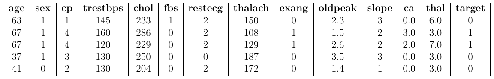

# PROJECT 4.2: HEART DISEASE DIAGNOSTIC PART 2
---------------------------------------------------
## 1. GENERAL
In the previous section, we laid the “foundations” for the heart disease prediction problem: understanding the Cleveland data structure, standardizing the preprocessing process, applying feature generation techniques, and building basic Machine Learning (ML) models such as Naive Bayes, K-Nearest Neighbors, Decision Tree, and even testing a basic ensemble variant. The results show that traditional models, when trained with carefully processed data, can achieve encouraging performance and help us understand the problem quite effectively.
## 2. DATA TYPE
The dataset used in this Project is based on the Cleveland Heart Disease. The Database includes the medical information of 303 patient with 13 input features as following snapshot table:

### Data Description
| **Feature** | **Description & Code Value**                                                      |
|-------------|-----------------------------------------------------------------------------------|
| age         | Age of patient                                                                    |
| sex         | 0 = male, 1 = female                                                              |
| trestbps    | Resting systolic blood pressure (mmHg)                                            |
| chol        | Serum cholesterol concentration (mg/dL)                                           |
| fbs         | Fasting blood sugar > 120 mg/dL. (1 = true, 0 = false)                            |
| restecg     | Resting ECG. (0 = normal, 1 = ST-T abnormality, 2 = left ventricular hypertrophy) |
| thalach     | Maximum heart rate achieved (beats/minute).                                       |
| exang       | Chest pain on exertion. (1 = yes, 0 = no)                                         |
| oldpeak     | ST depression severity with exercise versus rest                                  |
| slope       | Slope of ST segment. (1 = uphill, 2 = flat, 3 = downhill)                         |
| ca          | Number of major blood vessels stained (0–3)                                       |
| thal        | Thalassemia (3 = normal, 6 = fixed defect, 7 = reversible defect)                 |
| num         | Target label. (0 = no disease, 1–4 = disease)                                     |

## 3. KEY FEATURES
* **Data Cleaning and Engineering**: The data is exported as DataFrame from `cleveland.csv`
* **Data Exploration**: to process the preprocessing the raw data from input with Mimax & Standard Scaler